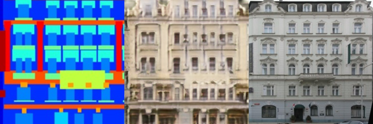

## StyleTransfer при помощи GAN'ов 

### CycleGAN
Процесс обучения и все архитектуры показаны в тетрадке [CycleGAN_training.ipynb](CycleGAN_training.ipynb)

Примеры случайных генераций на тестовом сете по эпохам:

(label - generated - true)

1 эпоха

50 эпоха

100 эпоха

150 эпоха

200 эпоха

Возможно, не стоило делать рандомные кропы в качестве аугментаций, тогда бы качество могло получиться чуть лучше. Но, к сожалению обучение отнимало очень много времени, и я не успел протестить без этих эффектов.
