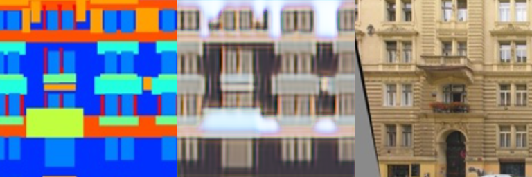
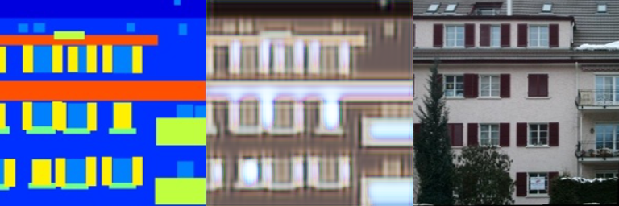

## StyleTransfer при помощи GAN'ов 

### CycleGAN
Процесс обучения и все архитектуры показаны в тетрадке [CycleGAN_training.ipynb](CycleGAN_training.ipynb)

Примеры случайных генераций на тестовом сете по эпохам:

1 эпоха

10 эпоха

