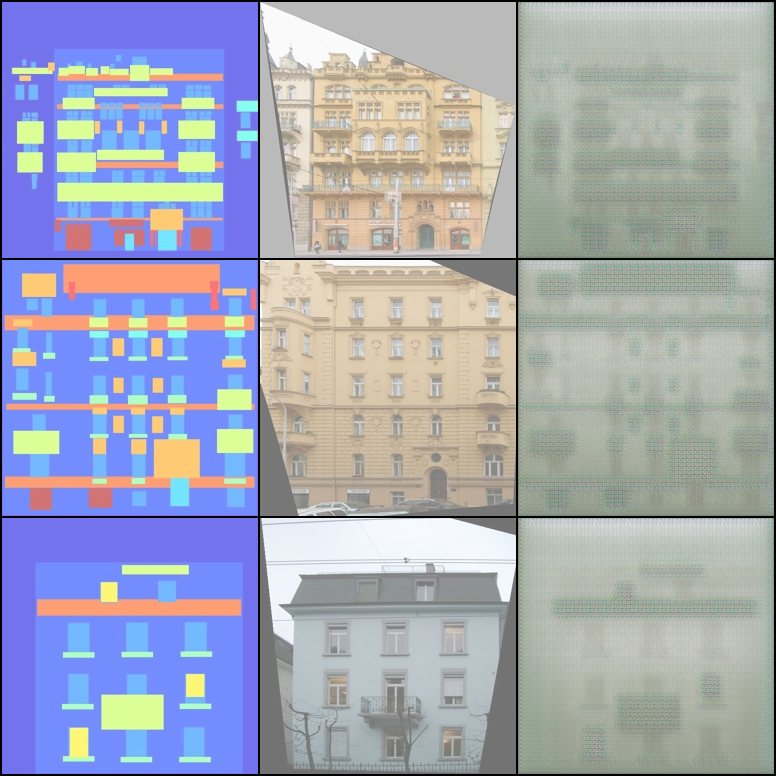
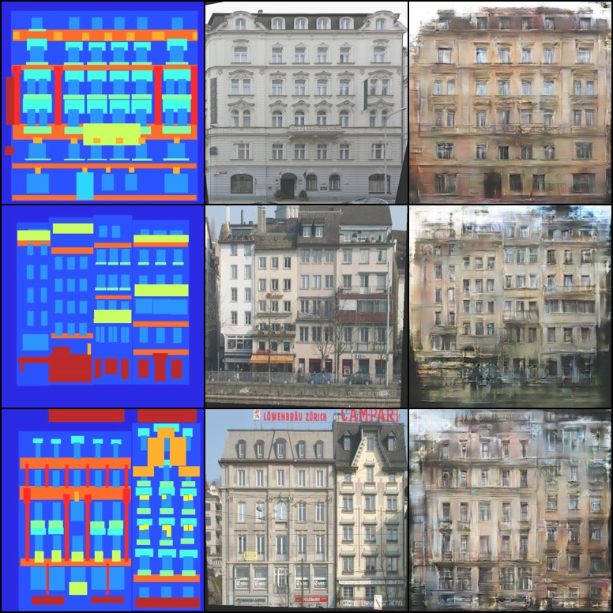
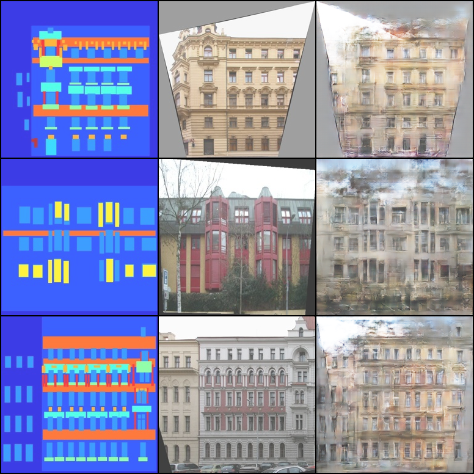

## Pix2pix
Процесс обучения и все архитектуры в тетрадке [pix2pix_training.ipynb](pix2pix_training.ipynb)

Примеры случайных генераций на тестовом сете по эпохам:

(label - generated - true)

1 эпоха

150 эпоха

300 эпоха

К сожалению, так и не удалось победить замыленность
